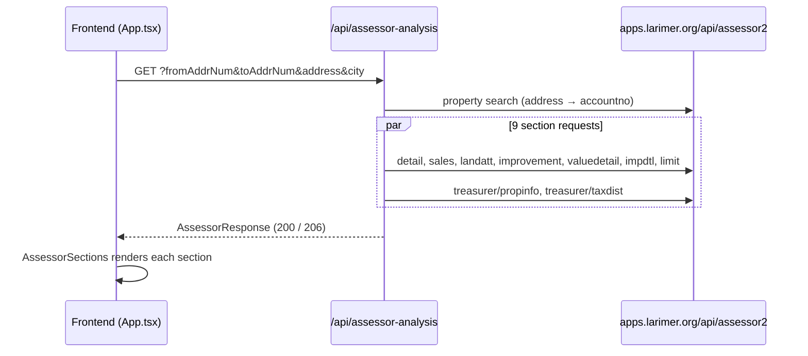

# Home Search

## Assessor analysis

Selecting a geocoded address on the map loads Larimer County assessor and treasurer records for that property and renders them in the full-width **Assessor analysis** section below the map.

### Flow



1. **Address normalization** — [frontend/src/App.tsx](frontend/src/App.tsx) (`toAddressQuery`) splits the canonical address into a house number and a bare street name. Directionals (`N`, `SW`, …) and suffixes (`Dr`, `Ave`, …) are stripped because the Larimer search only matches bare street names. City is fixed to `FORT COLLINS`.
2. **Account lookup** — [api/src/assessor/client.ts](api/src/assessor/client.ts) calls the property search and extracts the first `accountno`.
3. **Section fan-out** — all sections are fetched in parallel with `Promise.allSettled`, each with an 8 s timeout. A failing section does not fail the request.

### API

`GET /api/assessor-analysis`

| Query param   | Required | Notes                                              |
| ------------- | -------- | -------------------------------------------------- |
| `fromAddrNum` | yes      | House number, max 12 chars                         |
| `toAddrNum`   | yes      | Defaults to `fromAddrNum`; max 12 chars            |
| `address`     | yes      | Bare street name (e.g. `Wyandotte`), max 120 chars |
| `city`        | yes      | e.g. `FORT COLLINS`, max 80 chars                  |
| `zip`         | no       |                                                    |

| Status | Meaning                                                          |
| ------ | ---------------------------------------------------------------- |
| `200`  | All sections loaded                                              |
| `206`  | Some sections failed; `partial: true` and `errors` lists them    |
| `400`  | Missing or oversized query params                                |
| `502`  | Property search unavailable, or no account found for the address |
| `504`  | Aggregation threw unexpectedly                                   |

The treasurer tax-district section is requested for the year in the `TAX_YEAR` app setting (default `2025`).

Example:

```sh
curl 'http://127.0.0.1:7071/api/assessor-analysis?fromAddrNum=2473&toAddrNum=2473&address=Wyandotte&city=FORT%20COLLINS'
```

### Response shape

Defined in [api/src/models/assessor.ts](api/src/models/assessor.ts):

```ts
interface AssessorResponse {
  address: { fromAddrNum: string; toAddrNum: string; address: string; city: string; zip?: string };
  accountno: string | null;
  sections: Record<SectionName, { status: "fulfilled" | "rejected"; data: unknown; error: string | null }>;
  errors: string[];
  partial: boolean;
}
```

Each fulfilled section's `data` is tabular: `{ columns: string[]; records: Record<string, string | null>[] }`. All values arrive as strings (e.g. `"225000.00"`, `".21"`), so the frontend parses numbers itself.

### Sections

| Section key             | Upstream `prop`      | Panel title       | Visualization                                                                                                                                                                                           |
| ----------------------- | -------------------- | ----------------- | ------------------------------------------------------------------------------------------------------------------------------------------------------------------------------------------------------- |
| `detail`                | `detail`             | Property          | Key/value summary: address, owner, mailing address, subdivision, legal, parcel, mill levy (local / school). Flags when the owner mailing address differs from the property.                             |
| `improvement`           | `improvement`        | Building          | Stat tiles (beds, baths, above-grade sf, basement total/finished, year built/remodeled, stories) plus style, condition, quality, HVAC, exterior, roof, foundation, neighborhood. One card per building. |
| `valueDetail`           | `valuedetail`        | Valuation         | Actual value, assessed value, assessment ratio; stacked bar of land vs. improvement value.                                                                                                              |
| `treasurerPropertyInfo` | `treasurer/propinfo` | Property tax      | Latest year's tax (with half-year split), actual/assessed value, balance due, due dates; SVG bar chart of annual tax across all years with total change.                                                |
| `treasurerTaxDistrict`  | `treasurer/taxdist`  | Tax breakdown     | Horizontal bars per taxing district for the latest year: amount, mill levy, share of bill.                                                                                                              |
| `sales`                 | `sales`              | Sales history     | Timeline, newest first. Deed codes are expanded (`WD`, `WDJ`, `QC`, …). `$0` transfers are muted as "No consideration"; market sales show % change from the previous market sale.                       |
| `improvementDetail`     | `impdtl`             | Building features | Rows grouped by type + description with units summed. Area types (basement, garage, porch, deck, patio, carport) show sf; others show a count.                                                          |
| `landAttributes`        | `landatt`            | Land              | Chips of attribute / description.                                                                                                                                                                       |
| `limit`                 | `limit`              | Tax district      | Key/value: tax district, tax area, account, schedule, parcel.                                                                                                                                           |

Every visualized section includes a collapsible **View table** with the raw columns and records. Any section without a dedicated view, or whose data isn't in `columns`/`records` form, falls back to a plain table. Rejected sections show their error message.

### Parcel number format

Larimer County parcel numbers (`parcelnb`) are 10 digits encoding the property's Public Land Survey System location. The Property section splits the number into these segments (`splitParcel` in [AssessorSections.tsx](frontend/src/features/assessor/AssessorSections.tsx)):

| Digits | Segment                            | Example `9726307001` | 2473 Wyandotte `9721420021` |
| ------ | ---------------------------------- | -------------------- | --------------------------- |
| 1      | Range (last digit; `9` = range 69) | `9`                  | `9`                         |
| 2      | Township                           | `7`                  | `7`                         |
| 3–4    | Section                            | `26`                 | `21`                        |
| 5      | Quarter section                    | `3`                  | `4`                         |
| 6–7    | Block                              | `07`                 | `20`                        |
| 8–10   | Lot                                | `001`                | `021`                       |

The parcel block/lot are survey-grid identifiers and may differ from the platted block/lot in the legal description (e.g. `LOT 21, BLK 2, BROWN FARM`). Parcels that aren't 10 digits are shown unsplit.

### Data notes

- `treasurerPropertyInfo.ACTUAL_LAND_VAL` / `ASSESSED_LAND_VAL` hold the **total** property value (land + improvement), not land only; the UI labels them "Actual value" / "assessed".
- `improvement.adjyrblt` is the assessor's effective year built, reflecting remodels.
- Deed-type labels and the area-vs-count rule for building features are frontend heuristics, not provided by the API.

### Code map

| Path                                                                                                       | Purpose                                                         |
| ---------------------------------------------------------------------------------------------------------- | --------------------------------------------------------------- |
| [api/AssessorAnalysis/index.ts](api/AssessorAnalysis/index.ts)                                             | Azure Function HTTP trigger (`assessor-analysis` route)         |
| [api/src/http/validation.ts](api/src/http/validation.ts)                                                   | Query param validation                                          |
| [api/src/assessor/endpoints.ts](api/src/assessor/endpoints.ts)                                             | Upstream URL builders and section list                          |
| [api/src/assessor/client.ts](api/src/assessor/client.ts)                                                   | Account lookup, parallel section fetch, partial-result handling |
| [api/src/models/assessor.ts](api/src/models/assessor.ts)                                                   | Response types                                                  |
| [frontend/src/features/assessor/AssessorSections.tsx](frontend/src/features/assessor/AssessorSections.tsx) | Section renderers and table fallback                            |

### Adding a section

1. Add the key to `SectionName` in [api/src/models/assessor.ts](api/src/models/assessor.ts) and to `sections` / the `prop` map in [api/src/assessor/endpoints.ts](api/src/assessor/endpoints.ts).
2. It will render as a table automatically. For a custom view, add a renderer to the `views` map in [AssessorSections.tsx](frontend/src/features/assessor/AssessorSections.tsx); map order controls display order.
